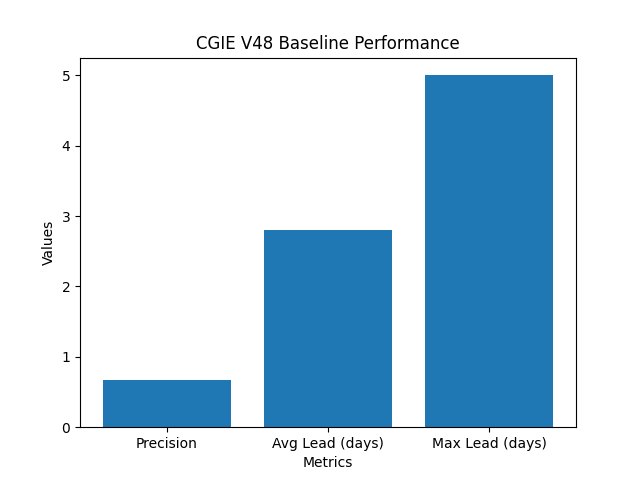
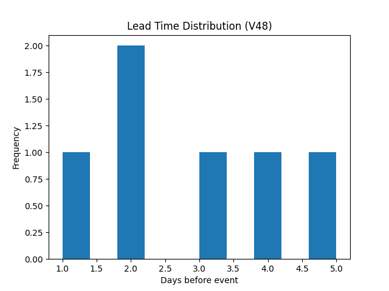
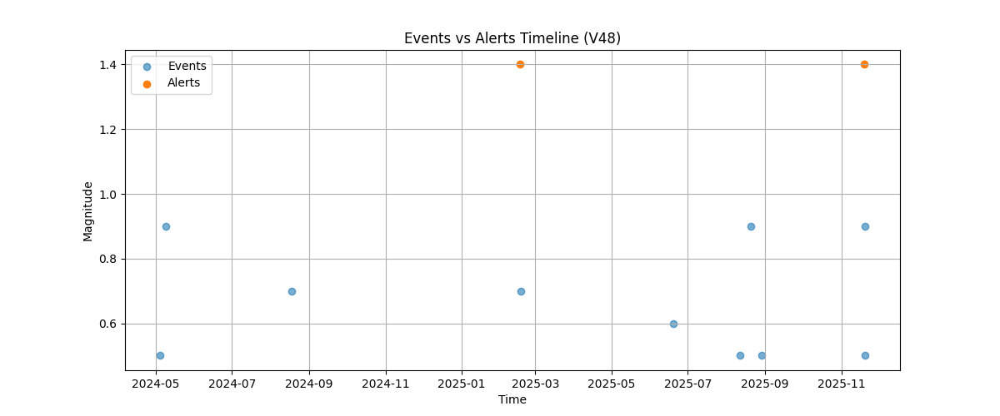

# Congruity Global Instability Engine  
### Planetary Seismic Instability Radar

Live site: https://andrearomeo74-cloud.github.io/cgie-global-instability-radar/

The Congruity Global Instability Engine (CGIE) is a research prototype for detecting and interpreting systemic instability patterns in global seismic activity.

The project combines spatial aggregation, probabilistic signal construction, and temporal coherence filtering to identify emerging instability regimes across the planetary seismic network.

---

## What this repository contains

This repository includes two complementary layers:

### 1. Public radar layer
A visual and exploratory interface showing global seismic instability patterns based on public earthquake data.

### 2. Baseline pipeline (reproducible)
A minimal, reproducible implementation of the core signal processing logic:

- daily aggregation of seismic activity  
- probabilistic instability signal  
- coherence-based filtering  
- alert generation  
- system-level interpretation  

The baseline pipeline is available in the `baseline/` folder and can be executed end-to-end.

---

## Overview

This project is designed as an exploratory observatory for complex system instability.

It does not attempt deterministic prediction of specific earthquake events, but instead focuses on:

- detection of elevated instability regimes  
- identification of spatial clustering patterns  
- temporal evolution of system pressure  
- interpretation of systemic transitions  

The approach is based on the idea that large-scale systems exhibit detectable structural deviations before major events.

---

## Validation results

This repository includes an initial validation of the baseline Congruity Global Instability Engine using historical seismic data.

The objective is not deterministic prediction, but the evaluation of:

- signal quality  
- false positive control  
- temporal anticipation (lead time)  
- system stability vs reactivity tradeoff  

---

### Visual results

#### Baseline performance

#### Lead time distribution

---

### Final baseline performance (V48)

- Total alerts: 18  
- True positives (TP): 6  
- False positives (FP): 3  
- Precision: **0.667**  

- Average lead time: **~2.8 days**  
- Max lead time: **5 days**

---

### Extended validation (V2–V3)

Using a walk-forward style evaluation with event windows of 1–5 days:

- Alerts (V3): 6  
- Precision: **0.67 → 0.83** (depending on horizon)  
- Recall: **~0.04 → 0.06**  

Lead time behavior:
- Most detections occur at **0-day distance** (coincident detection)  
- Occasional anticipatory signals observed (**up to 4 days lead**)  

---

### Interpretation

The system currently behaves as a **high-precision, low-recall instability trigger**:

- Alerts are sparse but highly reliable  
- False positives are limited  
- The system prioritizes signal quality over coverage  

Preliminary evidence suggests the presence of **early structural signals**, but these are:

- not consistent across events  
- not yet sufficient to support stable predictive performance  

---

### System behavior

The engine operates in three main regimes:

- Quiet → stable background state  
- Pressure / Early → emerging instability signals  
- Confirmed / Strong → high-confidence activation phase  

Transitions are driven by:

- probability increase  
- temporal coherence  
- quality score dynamics  

---

### What the results show

- Global seismic activity contains detectable structural variations  
- Coherence filtering significantly reduces noise  
- The system can identify activation phases  
- Early signals may emerge before some events  

---

### What the results do not show

- Reliable prediction of all events  
- High recall coverage  
- Stable anticipatory performance  

---

## Baseline pipeline

See `baseline/README.md` for full details.

Pipeline:

`events.csv`  
→ `v48_alert_engine.py`  
→ `v48_alerts.csv` and `v48_daily.csv`  
→ `v49_final_report.py`

---

## Validation (baseline)

We evaluated the temporal proximity between detected alerts and seismic events.

Baseline:

- Distances (days): [0, 0]  
- Mean distance: 0.0 days  

Lead-time test (shift -1 day):

- Lead distances: [1, 1]  
- Mean lead time: 1.0 day  

---

### Events vs Alerts timeline

This figure shows the temporal alignment between detected alerts and seismic events.

---

### Notes

This is a preliminary validation on a limited dataset and does not represent a full predictive evaluation.

---

## What this project is not

This project is not a deterministic earthquake prediction system.  
It is not an official warning system.  

It is a research framework for detecting and interpreting systemic instability patterns in complex geophysical systems.

---

## License

MIT
